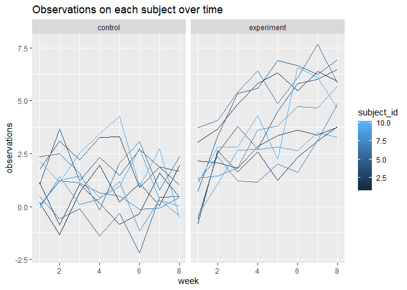
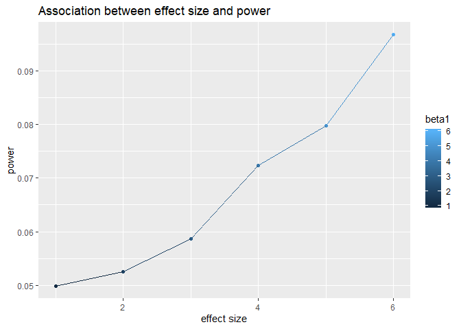

hw5\_xl2851
================
xinran
10/31/2019

``` r
library(tidyverse)
```

    ## -- Attaching packages --------------------------------------- tidyverse 1.2.1 --

    ## v ggplot2 3.2.1     v purrr   0.3.3
    ## v tibble  2.1.3     v dplyr   0.8.3
    ## v tidyr   1.0.0     v stringr 1.4.0
    ## v readr   1.3.1     v forcats 0.4.0

    ## -- Conflicts ------------------------------------------ tidyverse_conflicts() --
    ## x dplyr::filter() masks stats::filter()
    ## x dplyr::lag()    masks stats::lag()

``` r
library(tidyr)
library(stringr)
```

# problem 1

``` r
set.seed(10)

iris_with_missing = iris %>% 
  map_df(~replace(.x, sample(1:150, 20), NA)) %>%
  mutate(Species = as.character(Species))
```

``` r
fill_missing=function(x){
  
  if(is.numeric(x)){
    x[is.na(x)]=mean(x,na.rm=TRUE)
    
  }else if (!is.numeric(x)){
    x[is.na(x)]="virginica"
  }
  
  x
}
```

``` r
output=map_dfr(iris_with_missing,fill_missing)
```

# problem 2

``` r
filenames=list.files(path="./data")%>%
  substr(1,6)

df= tibble(
  filenames = list.files(path="./data"),
  path = str_c("./data/", filenames)
)%>%
  mutate(
    obs_time = map(path, read_csv),
  )%>%
  unnest()%>%
  select(-path)%>%
  mutate(
    arm = substr(filenames, 1, 3),
    arm = recode(arm, "con" = "control",
                      "exp" = "experiment"),
    subject_id=substr(filenames,5,6),
    subject_id=as.numeric(subject_id))%>%
  pivot_longer(
    week_1:week_8,
    names_to = "week",
    values_to = "obs"
  )%>%
  mutate(
    week=substr(week, 6,7),
    week=as.numeric(week)
  )%>%
  select(-filenames)
```

    ## Parsed with column specification:
    ## cols(
    ##   week_1 = col_double(),
    ##   week_2 = col_double(),
    ##   week_3 = col_double(),
    ##   week_4 = col_double(),
    ##   week_5 = col_double(),
    ##   week_6 = col_double(),
    ##   week_7 = col_double(),
    ##   week_8 = col_double()
    ## )
    ## Parsed with column specification:
    ## cols(
    ##   week_1 = col_double(),
    ##   week_2 = col_double(),
    ##   week_3 = col_double(),
    ##   week_4 = col_double(),
    ##   week_5 = col_double(),
    ##   week_6 = col_double(),
    ##   week_7 = col_double(),
    ##   week_8 = col_double()
    ## )
    ## Parsed with column specification:
    ## cols(
    ##   week_1 = col_double(),
    ##   week_2 = col_double(),
    ##   week_3 = col_double(),
    ##   week_4 = col_double(),
    ##   week_5 = col_double(),
    ##   week_6 = col_double(),
    ##   week_7 = col_double(),
    ##   week_8 = col_double()
    ## )
    ## Parsed with column specification:
    ## cols(
    ##   week_1 = col_double(),
    ##   week_2 = col_double(),
    ##   week_3 = col_double(),
    ##   week_4 = col_double(),
    ##   week_5 = col_double(),
    ##   week_6 = col_double(),
    ##   week_7 = col_double(),
    ##   week_8 = col_double()
    ## )
    ## Parsed with column specification:
    ## cols(
    ##   week_1 = col_double(),
    ##   week_2 = col_double(),
    ##   week_3 = col_double(),
    ##   week_4 = col_double(),
    ##   week_5 = col_double(),
    ##   week_6 = col_double(),
    ##   week_7 = col_double(),
    ##   week_8 = col_double()
    ## )
    ## Parsed with column specification:
    ## cols(
    ##   week_1 = col_double(),
    ##   week_2 = col_double(),
    ##   week_3 = col_double(),
    ##   week_4 = col_double(),
    ##   week_5 = col_double(),
    ##   week_6 = col_double(),
    ##   week_7 = col_double(),
    ##   week_8 = col_double()
    ## )
    ## Parsed with column specification:
    ## cols(
    ##   week_1 = col_double(),
    ##   week_2 = col_double(),
    ##   week_3 = col_double(),
    ##   week_4 = col_double(),
    ##   week_5 = col_double(),
    ##   week_6 = col_double(),
    ##   week_7 = col_double(),
    ##   week_8 = col_double()
    ## )
    ## Parsed with column specification:
    ## cols(
    ##   week_1 = col_double(),
    ##   week_2 = col_double(),
    ##   week_3 = col_double(),
    ##   week_4 = col_double(),
    ##   week_5 = col_double(),
    ##   week_6 = col_double(),
    ##   week_7 = col_double(),
    ##   week_8 = col_double()
    ## )
    ## Parsed with column specification:
    ## cols(
    ##   week_1 = col_double(),
    ##   week_2 = col_double(),
    ##   week_3 = col_double(),
    ##   week_4 = col_double(),
    ##   week_5 = col_double(),
    ##   week_6 = col_double(),
    ##   week_7 = col_double(),
    ##   week_8 = col_double()
    ## )
    ## Parsed with column specification:
    ## cols(
    ##   week_1 = col_double(),
    ##   week_2 = col_double(),
    ##   week_3 = col_double(),
    ##   week_4 = col_double(),
    ##   week_5 = col_double(),
    ##   week_6 = col_double(),
    ##   week_7 = col_double(),
    ##   week_8 = col_double()
    ## )
    ## Parsed with column specification:
    ## cols(
    ##   week_1 = col_double(),
    ##   week_2 = col_double(),
    ##   week_3 = col_double(),
    ##   week_4 = col_double(),
    ##   week_5 = col_double(),
    ##   week_6 = col_double(),
    ##   week_7 = col_double(),
    ##   week_8 = col_double()
    ## )
    ## Parsed with column specification:
    ## cols(
    ##   week_1 = col_double(),
    ##   week_2 = col_double(),
    ##   week_3 = col_double(),
    ##   week_4 = col_double(),
    ##   week_5 = col_double(),
    ##   week_6 = col_double(),
    ##   week_7 = col_double(),
    ##   week_8 = col_double()
    ## )
    ## Parsed with column specification:
    ## cols(
    ##   week_1 = col_double(),
    ##   week_2 = col_double(),
    ##   week_3 = col_double(),
    ##   week_4 = col_double(),
    ##   week_5 = col_double(),
    ##   week_6 = col_double(),
    ##   week_7 = col_double(),
    ##   week_8 = col_double()
    ## )
    ## Parsed with column specification:
    ## cols(
    ##   week_1 = col_double(),
    ##   week_2 = col_double(),
    ##   week_3 = col_double(),
    ##   week_4 = col_double(),
    ##   week_5 = col_double(),
    ##   week_6 = col_double(),
    ##   week_7 = col_double(),
    ##   week_8 = col_double()
    ## )
    ## Parsed with column specification:
    ## cols(
    ##   week_1 = col_double(),
    ##   week_2 = col_double(),
    ##   week_3 = col_double(),
    ##   week_4 = col_double(),
    ##   week_5 = col_double(),
    ##   week_6 = col_double(),
    ##   week_7 = col_double(),
    ##   week_8 = col_double()
    ## )
    ## Parsed with column specification:
    ## cols(
    ##   week_1 = col_double(),
    ##   week_2 = col_double(),
    ##   week_3 = col_double(),
    ##   week_4 = col_double(),
    ##   week_5 = col_double(),
    ##   week_6 = col_double(),
    ##   week_7 = col_double(),
    ##   week_8 = col_double()
    ## )
    ## Parsed with column specification:
    ## cols(
    ##   week_1 = col_double(),
    ##   week_2 = col_double(),
    ##   week_3 = col_double(),
    ##   week_4 = col_double(),
    ##   week_5 = col_double(),
    ##   week_6 = col_double(),
    ##   week_7 = col_double(),
    ##   week_8 = col_double()
    ## )
    ## Parsed with column specification:
    ## cols(
    ##   week_1 = col_double(),
    ##   week_2 = col_double(),
    ##   week_3 = col_double(),
    ##   week_4 = col_double(),
    ##   week_5 = col_double(),
    ##   week_6 = col_double(),
    ##   week_7 = col_double(),
    ##   week_8 = col_double()
    ## )
    ## Parsed with column specification:
    ## cols(
    ##   week_1 = col_double(),
    ##   week_2 = col_double(),
    ##   week_3 = col_double(),
    ##   week_4 = col_double(),
    ##   week_5 = col_double(),
    ##   week_6 = col_double(),
    ##   week_7 = col_double(),
    ##   week_8 = col_double()
    ## )
    ## Parsed with column specification:
    ## cols(
    ##   week_1 = col_double(),
    ##   week_2 = col_double(),
    ##   week_3 = col_double(),
    ##   week_4 = col_double(),
    ##   week_5 = col_double(),
    ##   week_6 = col_double(),
    ##   week_7 = col_double(),
    ##   week_8 = col_double()
    ## )

    ## Warning: `cols` is now required.
    ## Please use `cols = c(obs_time)`

## spaghetti

``` r
df%>%
  ggplot(aes(x = week, y = obs, group= subject_id,color=subject_id)）+
  geom_line() +facet_grid(. ~arm) +
   labs(
    title = "Observations on each subject over time",
    x = "week",
    y = "observations"
  ) 
```

<!-- -->

comments:We can see an obvious increasing trend of values of
observations over time in the experiment group.

# problem 3

``` r
sim_regression = function(n=30, beta0 = 2, beta1 = 0，sigma=50) {
  
  sim_data = tibble(
    xi1 = rnorm(n, mean = 0, sd = 1),
    yi = beta0 + beta1 * xi1 + rnorm(n, 0, sigma)
  )
  
  ls_fit = lm(yi ~ xi1, data = sim_data)
  
    tibble(
    beta1_hat = broom::tidy(ls_fit)$estimate[2],
    p_value = broom::tidy(ls_fit)$p.value[2],
    alpha=0.05
  )
}

sim_results1 = 
  rerun(10000, sim_regression(30, 2, 0)) %>% 
  bind_rows()
```

``` r
beta1_list = list("beta11"  = 1, 
              "beta12"  = 2, 
              "beta13" = 3, 
              "beta14" = 4,
              "beta15" = 5,
              "beta16" = 6)
output = vector("list", length = 6)

for (i in 1:6) {
  output[[i]] = rerun(10000, sim_regression(beta1_list[[i]])) %>% 
    bind_rows
}
```

``` r
sim_results2 = 
  tibble(beta1 = c(1, 2, 3, 4, 5, 6)) %>% 
  mutate(
    output_lists = map(.x = beta1, ~rerun(10000, sim_regression(beta1 = .x))),
    estimate_dfs = map(output_lists, bind_rows)) %>% 
  select(-output_lists) %>% 
  unnest(estimate_dfs)
```

``` r
  sim_results2%>%
  group_by(beta1)%>%
  mutate(
    power_test=sum(p_value<0.05)/10000
    ) %>% 
  ungroup()%>%
  ggplot(aes(x = beta1, y = power_test, color=beta1)) + 
  geom_point()+geom_line()+
  labs(
    title = "Association between effect size and power",
    x = "effect size",
    y = "power"
  ) 
```

<!-- --> From the
plot above we can see as effect size increases, power increases.
